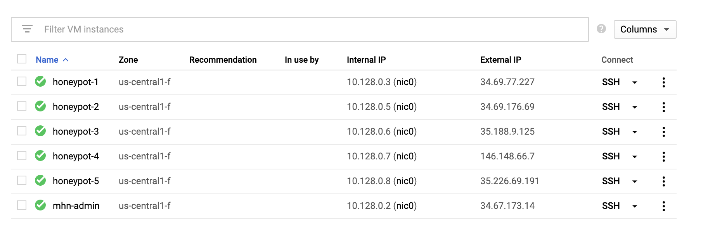
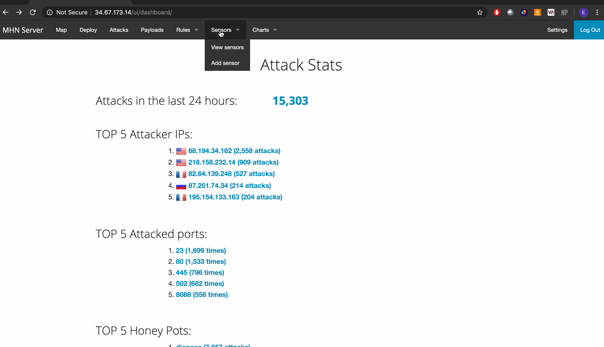
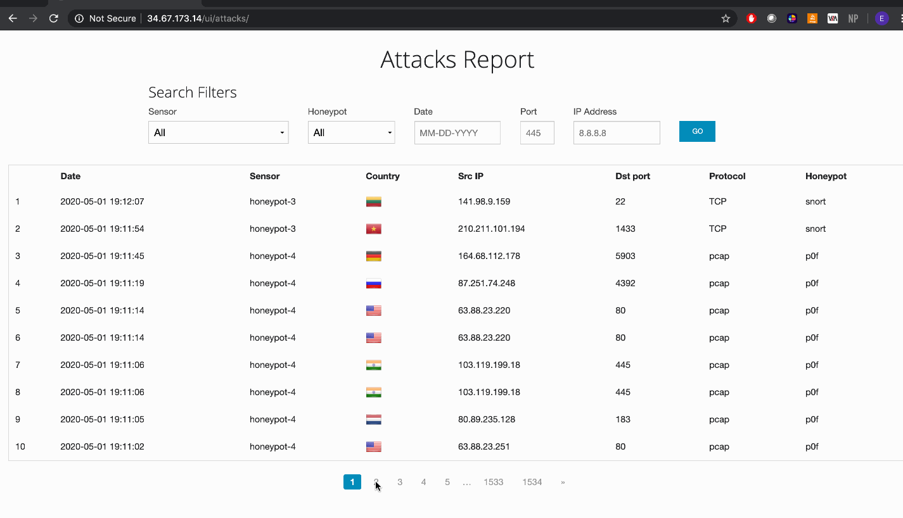
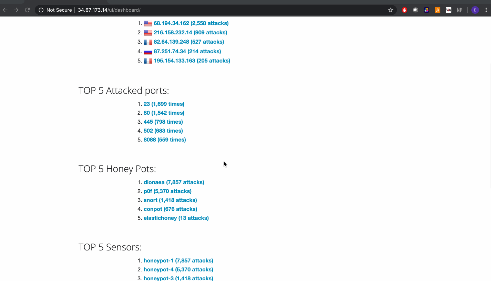
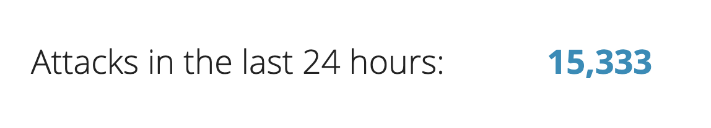
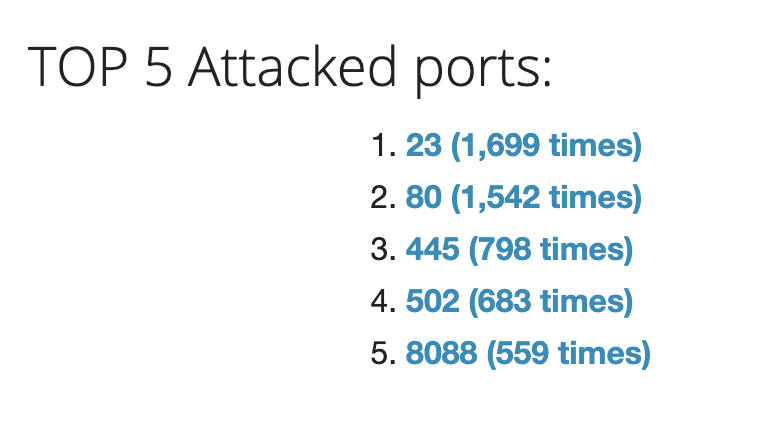
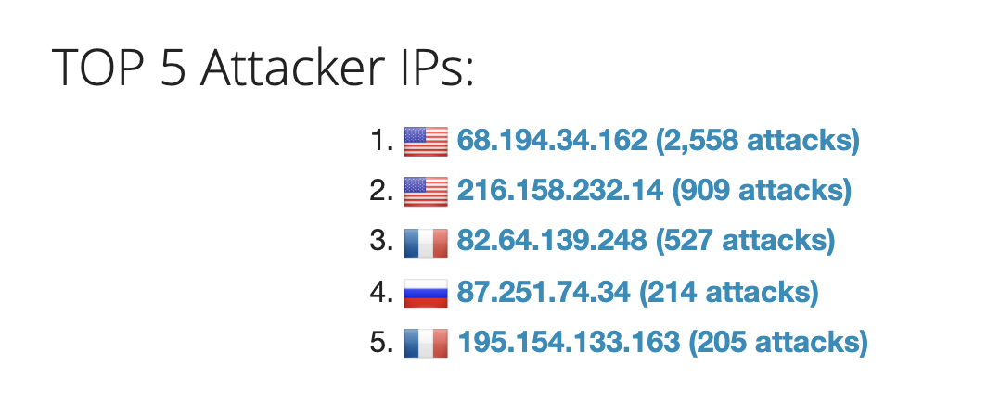
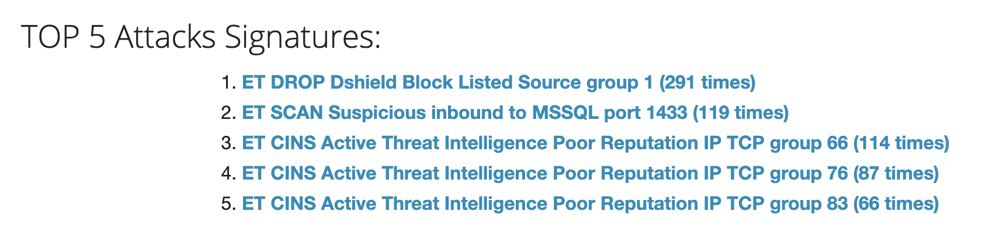
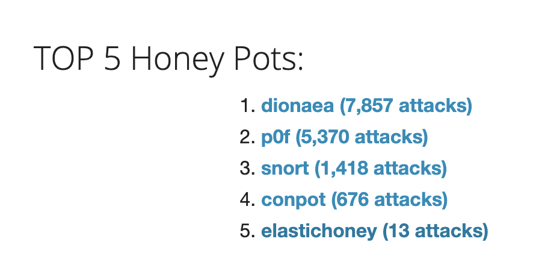
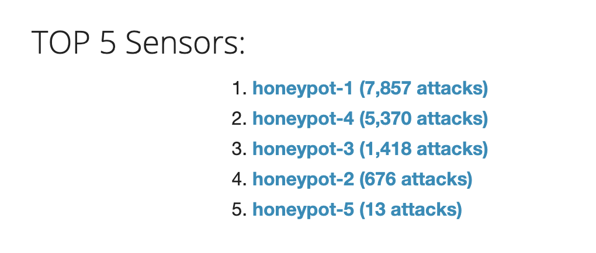

# Web-Security-Week9

# Project 9 - Honeypot

Time spent: **15** hours spent in total

## Which HoneyPot(s) you deployed 

## Any issues you encountered
Suprisingly, none.

## A summary of the data collected: number of attacks, number of malware samples, etc.

 
 
 

## Any unresolved questions raised by the data collected 
  > None.

## Resources

GIFs created with [LiceCap](http://www.cockos.com/licecap/).

## License

    Copyright [2020] [Eram Manasia]

    Licensed under the Apache License, Version 2.0 (the "License");
    you may not use this file except in compliance with the License.
    You may obtain a copy of the License at

        http://www.apache.org/licenses/LICENSE-2.0

    Unless required by applicable law or agreed to in writing, software
    distributed under the License is distributed on an "AS IS" BASIS,
    WITHOUT WARRANTIES OR CONDITIONS OF ANY KIND, either express or implied.
    See the License for the specific language governing permissions and
    limitations under the License.
